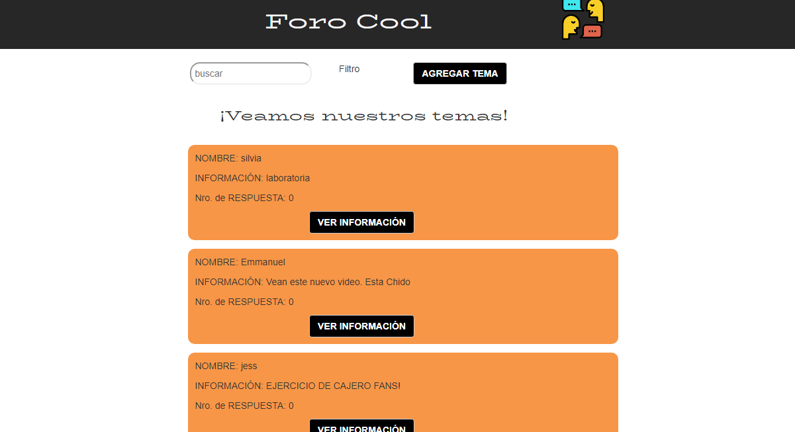
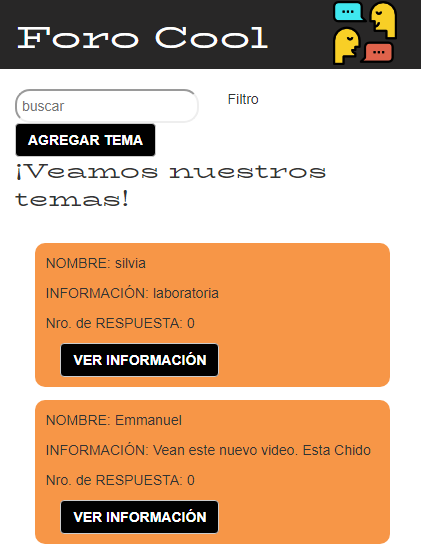

# FORO DE OPINIÓN

## Vista Desktop:

## Vista mobile:

## Objetivo:

El objetivo es crear un foro donde se puedan crear temas y responder a esos temas. Un tema tiene:

+ Un título
+ Un contador de número de respuestas
+ Un autor

Una respuesta tiene:

+ Un topic_id (para saber de que tema es la respuesta)
+ El contenido de la respuesta
+ El autor

## Herramientas:

+ Foro API, es una API para poder crear y consultar temas y las respuestas a esos temas.
+ Mock ups de la aplicación y del filtro de búsqueda, en los que se muestra el diseño.
+ Bootstrap, para la maquetación del proyecto.
+ Jquery.
+ AJAX, como técnica de desarrollo web que hace posible realizar cambios sobre las páginas sin necesidad de recargarlas.
+ HTML5.
+ CSS3.

## Créditos:

+ Nefeli Joñoruco.
+ Patricia Urco.